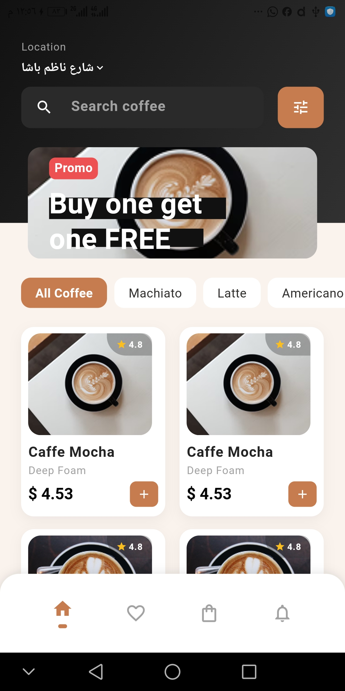
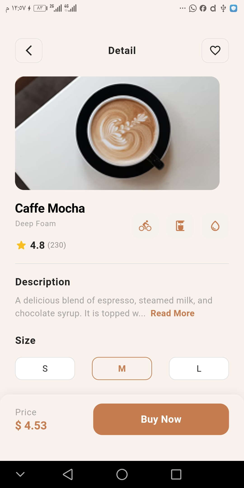
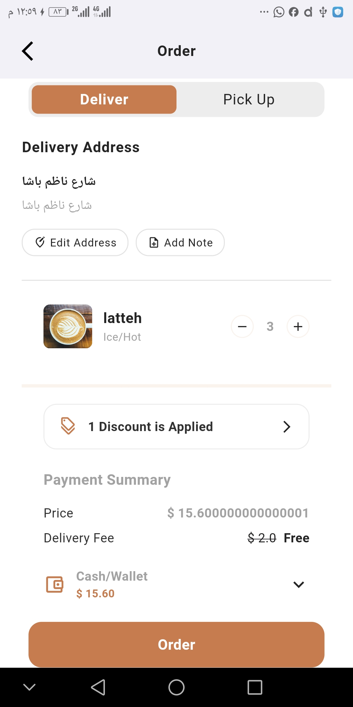
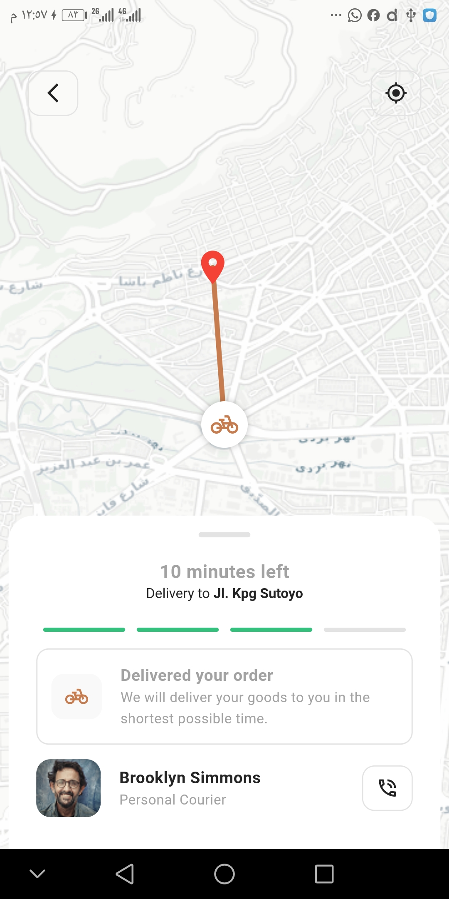

# Coffee Shop App ☕️

A premium Flutter mobile application for coffee lovers, featuring a sleek UI, real-time data management, and geolocation tracking.

## 🚀 Key Features & Functionalities

This project isn't just a UI; it's a fully functional app with a robust backend and state management:

### 🛠 Backend Integration (Supabase)
- **Database:** Leveraged **Supabase** (PostgreSQL) for storing coffee products, categories, and user data.
- **Efficient Queries:** Implemented advanced filtering logic directly from the backend to ensure high performance.
- **Real-time Data:** Seamlessly fetching product details and ratings.

### 🔍 Advanced Search & Filtering
- **Dynamic Search:** Real-time search functionality that updates the product list as you type.
- **Category-Based Filtering:** Users can browse coffee by type (e.g., Espresso, Latte, Cappuccino) using dynamic queries.
- **Price Range Filtering:** Integrated logic to filter products based on a maximum price point.

### 🏗 State Management (Provider)
- Used **Provider** to manage the global state of the application.
- **Cart Logic:** Handled complex cart operations, including individual product quantities using a `Map<String, int>` to ensure data integrity across the app.
- **Theme & UI Logic:** Managing application-wide states like delivery address, notes, and subtotal calculations.

### 📍 Geolocation & Tracking
- **Map Integration:** Used `flutter_map` (OpenStreetMap) to provide a smooth map experience without expensive API keys.
- **Geocoding:** Integrated the `geocoding` package to convert human-readable addresses (Strings) into geographical coordinates (Latitude & Longitude).
- **Live Location Logic:** Used `latlong2` for precise coordinate handling and distance calculations.

## 📱 Tech Stack
- **Frontend:** Flutter & Dart
- **State Management:** Provider
- **Backend-as-a-Service:** Supabase
- **UI Scaling:** Flutter ScreenUtil
- **Design Pattern:** Clean Architecture principles

## 📸 Screenshots

| onboarding screen | home screen | details screen | order screen | tracking screen |
| :---: | :---: | :---: | :---: | :---: |
|  |  |  |  |  |

## ⚙️ Setup & Installation
1. Clone the repository: `git clone https://github.com/your-username/task4.git`
2. Install dependencies: `flutter pub get`
3. Configure your Supabase keys in `supabase_service.dart`.
4. Run the app: `flutter run`